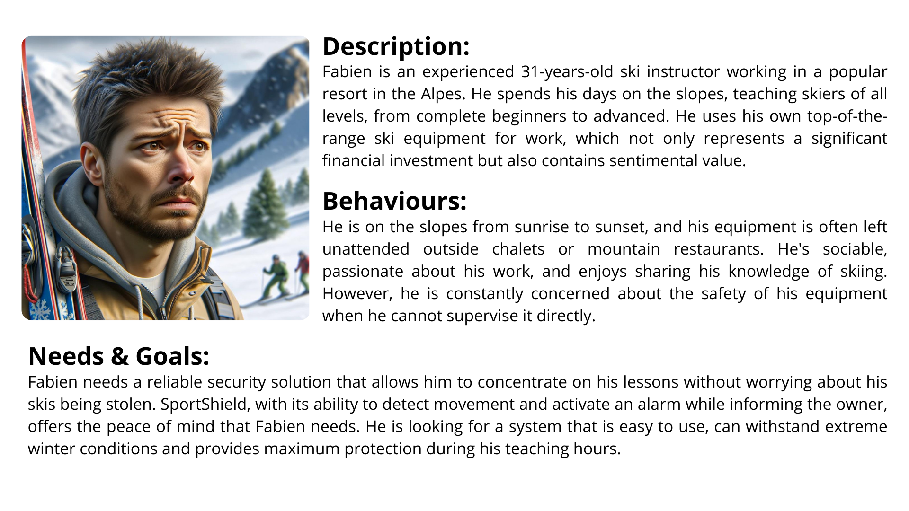
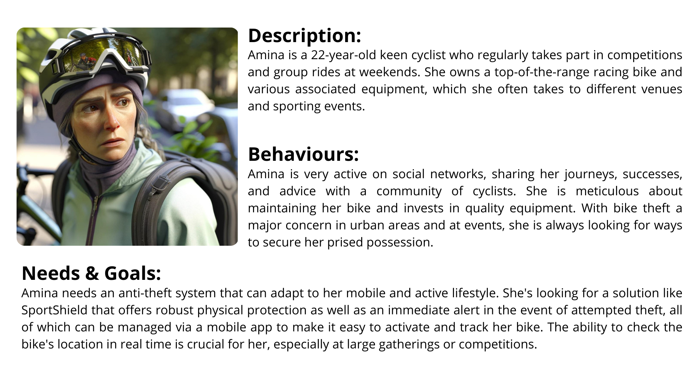
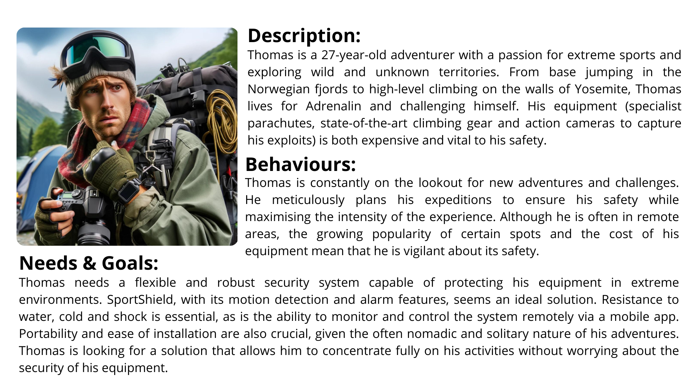

|              |              |
| ------------ | :----------: |
| Author       | Mathis LEBEL |
| Reviewers    | Lucas MEGNAN |
| Created on   |  2024-03-14  |
| Last updated |  2024-03-18  |

   # SportShield Anti-theft - Functional specifications

   This project was requested by [CORIS INNOVATION](https://www.corisinnovation.com), a French engineering consultancy.

   *SportShield* is an advanced anti-theft solution tailored for sports equipment. Equipped with sensors and actuators, it detects movement, triggers alarms and notifies owners of potential theft attempts.

   In this project we're focusing on refining the functionality and code base of *SportShield*. Our goals include optimising battery usage, integrating NFC device management, improving alarm functionality and enhancing security features.

Table of Contents

- [I. Stakeholders](#i-stakeholders)
  - [1. Project members](#1-project-members)
  - [2. Other stakeholders](#2-other-stakeholders)
- [II. Project scope](#ii-project-scope)
- [III. Functional requirements](#iii-functional-requirements)
- [IV. Deliverables and milestones](#iv-deliverables-and-milestones)
    - [1. Final product](#1-final-product)
- [V. Personas and use cases](#v-personas-and-use-cases)
  - [1. Persona 1 - Fabien](#1-persona-1---fabien)
  - [2. Persona 2 - Amina](#2-persona-2---amina)
  - [3. Persona 3 - Thomas](#3-persona-3---thomas)
- [VI. Acceptance criteria](#vi-acceptance-criteria)
- [VII. Solution overview](#vii-solution-overview)
  - [1. Battery Management](#1-battery-management)
      - [1.1. Key Features](#11-key-features)
      - [1.2. Technology Stack](#12-technology-stack)
      - [1.3. Strategy](#13-strategy)
  - [2. NFC Chip](#2-nfc-chip)
      - [2.1 Key Features 2](#21-key-features-2)
      - [2.2 Technical Implementation](#22-technical-implementation)
      - [2.3. Advantages](#23-advantages)
  - [3. Alarm Management](#3-alarm-management)
      - [3.1. Key Features 3](#31-key-features-3)
      - [3.2. Technical Implementation 2](#32-technical-implementation-2)
      - [3.3. Advantages 2](#33-advantages-2)
- [VIII. Non-functional requirements](#viii-non-functional-requirements)
  - [1. Performance](#1-performance)
  - [2. Maintainability](#2-maintainability)
  - [3. Security](#3-security)
- [IX. Risks and Assumptions](#ix-risks-and-assumptions)
- [X. Glossary](#x-glossary)
- [XI. Conclusion](#xi-conclusion)

## I. Stakeholders

### 1. Project members

| Role               | Photo                                                                                   | Name             | Email                                             | LinkedIn                                                                                         | GitHub                                                                                       |
|--------------------|-----------------------------------------------------------------------------------------|------------------|---------------------------------------------------|---------------------------------------------------------------------------------------------------|----------------------------------------------------------------------------------------------|
| Project Manager    |              | Loris DE MATTIA  |  |  |  |
| Program Manager    |              | Mathis LEBEL     |   |  |  |
| Technical Lead     |              | Séréna BAVAROIS  |  |  |  |
| Technical Writer   |          | Camille GAYAT    |    |  |      |
| Software Developer |               | Rémy CHARLES     |     |  |  |
| Quality Assurance  |              | Lucas MEGNAN     |     |  |  |

### 2. Other stakeholders

| Name | Occupation | Links |
| -------------- | --------------------------- | ------------------------------ |
| CORIS INNOVATION |   Client  |  |

## II. Project scope
This project has multiple objectives:

- Improvement of an anti-theft device for sports equipment. 
- Improvement of the battery duration.
- Implementation of an NFC chip.
- Ensure that the user can deactivate the alarm.
- Manage the alarm sound when a theft occurs and send http requests. 
- Improve security issues. 

## III. Functional requirements

The improvements made to the project must allow :
  - A battery life of at least 7 days with a daily use of 2 hours.
  - More efficient battery management.
  - Efficient distribution of battery energy.
  - Good use of the NFC chip.
  - The alarm can only be switched off by the user.
  - Sending of http request with geographical coordinates when a theft is detected.
  - Better management of security problems.

All project objectives must be written in C++ language, and on the Arduino IDE. There is no need to use libraries other than those provided for the hardware to succeed in the project.

We must also be careful not to damage the equipment provided for the project for its proper functioning on the day of the final presentation.

## IV. Deliverables and milestones

| Date and time       | Deliverable              |
| ------------------- | ------------------------ |
| 18 March 2024, 5 PM | Functional Specification |
| 26 March 2024, 5 PM | Technical Specification  |
| 10 April 2024, 5 PM | Test Plan                |
| 10 April 2024, 5 PM | User Manual              |
| 10 April 2024, 5 PM | Final product            |

#### 1. Final product

The Final product consists of:
- Battery Consumption Management.
- Device Management with NFC.
- Alarm Management and Simultaneous Actions.
- Security Issues
 
## V. Personas and use cases

### 1. Persona 1 - Fabien

### 2. Persona 2 - Amina

### 3. Persona 3 - Thomas

## VI. Acceptance Criteria

To ensure the *SportShield* project meets its objectives, the following acceptance criteria have been established:

1. **Battery Life**
   - The device must maintain functionality for at least **7 days** with **2 hours** of daily use without requiring a recharge.

2. **Efficient Battery Management**
   - Implements optimized battery management to extend battery life and distribute energy efficiently.

3. **NFC Chip Utilization**
   - Integrates an NFC chip allowing users to easily manage their equipment via a compatible mobile device.

4. **Alarm Desactivation**
   - Ensures the alarm can only be desactivated by the authenticated user, thereby preventing unauthorized deactivation.

5. **Theft Notification**
   - When theft is detected, the device sends an HTTP request with the geographical coordinates to a pre-configured server to alert the user.

6. **Enhanced Security**
   - Enhances security measures to prevent hacking or bypassing the alarm system.

7. **Documentation and Usage**
   - Provides clear and concise documentation, including a detailed user manual. The source code should be in C++ and compatible with the Arduino IDE, requiring only the libraries provided for the hardware.

8. **Equipment Integrity**
   - Maintains the integrity of the provided equipment throughout the development process to ensure its proper function during the final presentation.

These criterias are designed to ensure that the *SportShield* project meets expectations for functionality, energy efficiency, security, and usability, while adhering to the specified deadlines and technical requirements.

## VII. Solution overview

### 1. Battery-management

The battery management system (BMS) for the *SportShield* project is designed with the goal of maximizing the efficiency and lifespan of the battery. This section outlines the key features and technologies employed in our battery management solution.

#### 1.1. Key Features:

- **Smart Energy Distribution**: Utilizes algorithms to optimize the distribution of power based on device usage patterns, ensuring the most critical functions have priority access to power.

- **Adaptive Charging**: Implements an adaptive charging protocol that adjusts the charging rate based on the battery's condition and history to promote battery health and longevity.

- **Low Power Modes**: Integrates low power modes for the device, automatically transitioning to a power-saving state during periods of inactivity.

- **Real-time Battery Monitoring**: Employs real-time monitoring of battery status, including charge level, health, and temperature, to prevent overcharging, deep discharge, and overheating.

- **NFC Integration**: Leverages the NFC chip not only for device management but also for enabling a quick and efficient setup process for power management settings personalized to the user's preferences.

#### 1.2. Technology Stack:

- **Programming Language**: The BMS is developed using C++, ensuring compatibility with the Arduino IDE and efficient execution on microcontroller-based systems.

- **Hardware**: Utilizes specific sensors and modules compatible with our microcontroller to monitor and manage the battery's status accurately.

#### 1.3. Strategy:

1. **Analysis of Usage Patterns**: By analyzing usage patterns, the BMS can predict periods of high and low usage, adjusting power distribution accordingly.

2. **Feedback Loop**: Incorporates a feedback loop from the monitoring system to continuously refine charging and power distribution strategies based on actual device usage and battery performance.

3. **User Customization**: Allows users to customize settings via an NFC-enabled smartphone app, providing control over power-saving features and notifications related to battery health.

By implementing these strategies and features, the *SportShield* project aims to deliver a robust and efficient battery management system that enhances the overall user experience while ensuring the device's reliability and durability.

### 2. NFC Chip

The Near Field Communication (NFC) chip plays a pivotal role in enhancing user interaction with the *SportShield* system. It enables simplified and secure management of the device, facilitating operations such as initial setup, alarm activation/deactivation, and device status checks. This section outlines the integration and key features of the NFC chip in our solution.

#### 2.1. Key Features 2:

- **Easy Pairing**: Allows users to easily connect their smartphone to *SportShield* by simply bringing the device close. This greatly simplifies the initial pairing and setup process.

- **Secure Management**: Provides an additional layer of security for user authentication before any setting changes or alarm deactivation, ensuring that only authorized users can control the device.

- **Real-time Information Exchange**: Facilitates rapid transmission of information between *SportShield* and the user's smartphone, such as security alerts, battery level, and current device status.

- **Configuration Updates**: Enables users to easily update the settings of their *SportShield* device, like alarm sensitivity or notification preferences, via their smartphone.

#### 2.2. Technical Implementation:

- **Hardware Integration**: The NFC chip is integrated in a way that minimizes impact on the device's energy consumption while providing an effective communication range.

- **Software Development**: The accompanying mobile application for *SportShield* is designed to fully leverage the capabilities of the NFC chip, offering an intuitive user interface for device management.

#### 2.3. Advantages:

1. **User Friendliness**: Significantly simplifies user interaction with the device, making the management of *SportShield* more accessible and less time-consuming.

2. **Enhanced Security**: Strengthens device security by only allowing authenticated modifications via NFC, thus reducing the risk of unauthorized tampering.

3. **Flexibility**: Offers users the ability to quickly customize their *SportShield* experience according to their needs, thereby improving satisfaction and the effectiveness of protection.

By integrating NFC technology into the *SportShield* system, we provide a solution that not only enhances the security of sports equipment but also improves the overall user experience through simplified management and more natural user interactions.

### 3. Alarm Management

The Alarm Management component of the *SportShield* system is a critical feature designed to deter theft and notify the user of potential security breaches. It incorporates advanced technologies and strategies to ensure the alarm is both effective. This section outlines the functionalities, technical implementation, and benefits of the Alarm Management system.

#### 3.1. Key Features 3:

- **Sensitivity Adjustment**: Users can adjust the sensitivity of the alarm, allowing for customization based on the environment in which the sports equipment is stored or used.

- **Immediate Notification**: Upon detecting unauthorized movement or tampering, the system sends an immediate alert to the user's smartphone through a secure connection, ensuring prompt awareness of potential theft.

- **Geolocation Integration**: In the event of a theft, the system can send the equipment's last known location to the user, aiding in recovery efforts.

- **Multiple Alarm Modes**: Includes various alarm modes, such as audible alarms to deter thieves on-site and silent alarms for covert notification of the owner without alerting the thief.

#### 3.2. Technical Implementation 2:

- **Sensor Integration**: Utilizes motion sensors and accelerometers to detect unauthorized movement or tampering. The system is calibrated to minimize false alarms while ensuring genuine threats are promptly detected.

- **Smartphone App Integration**: The Alarm Management system is fully integrated with the *SportShield* smartphone app, allowing users to manage alarm settings, receive notifications, and view equipment location directly from their phone.

- **Energy-Efficient Design**: Despite its sophisticated functionality, the alarm system is designed to be energy-efficient, minimizing battery consumption and ensuring the device remains operational for extended periods.

#### 3.3. Advantages 2:

1. **Enhanced Security**: Provides a robust deterrent against theft, significantly reducing the risk of sports equipment being stolen.

2. **User Customization**: Allows users to tailor the alarm system to their specific needs, ensuring maximum protection without unnecessary inconvenience.

3. **Peace of Mind**: Offers sports equipment owners peace of mind, knowing their valuables are protected by a sophisticated and responsive alarm system.

By integrating these advanced Alarm Management features into the *SportShield* system, we provide an effective, customizable, and user-friendly solution for protecting valuable sports equipment against theft. This comprehensive approach ensures that users can enjoy their sporting activities with confidence, knowing their equipment is secure.

## VIII. Non-functional requirements

### 1. Performance
The performance of the *SportShield* system is crucial for ensuring effective and responsive protection against the theft of sports equipment. The following performance requirements must be met to deliver an optimal user experience while maintaining robust security.

### 2. Maintainability
Maintainability is a key factor in ensuring the long-term success and manageability of the *SportShield* system. System design and implementation should follow best practices allowing for easy updates, bug fixes, and improvements.

### 3. Security
Security is paramount for the *SportShield* system, given its role in protecting valuable sports equipment from theft. The system must employ comprehensive security measures to prevent unauthorized access and ensure data integrity and confidentiality.

## IX. Risks and Assumptions

| ID    | Description                                           | Risks                                                                                                                                                                   | Impact                                                    | Likelihood                                                | Solution                                                                                                                                                                                                                       |
|-------|-------------------------------------------------------|--------------------------------------------------------------------------------------------------------------------------------------------------------------------------|-----------------------------------------------------------|-----------------------------------------------------------|----------------------------------------------------------------------------------------------------------------------------------------------------------------------------------------------------------------------------------|
| **1** | Integrating NFC Device Management                     | Difficulty in integrating NFC with existing systems may lead to delays or reduced functionality.                                                                         |          |      | Conduct thorough research and prototyping with NFC technology to understand integration challenges. Collaborate with NFC experts or consult with the NFC chip providers for technical support.                                  |
| **2** | Optimizing Battery Usage                              | Inadequate optimization could result in poor battery life, affecting device reliability.                                                                                  |          |          | Implement adaptive power-saving features and rigorous testing under various usage scenarios to identify and address energy inefficiencies.                                                                                      |
| **3** | Enhancing Alarm Functionality                         | The alarm may not effectively deter theft if it is not loud enough or if it fails to trigger under certain conditions.                                                   |          |      | Design the alarm system with adjustable sensitivity settings and multiple alarm modes (e.g., audible, silent notifications). Perform extensive field testing to ensure reliability.                                              |
| **4** | Ensuring Device Security                              | Potential vulnerabilities could be exploited by attackers to bypass the alarm or access sensitive user data.                                                             |          |          | Incorporate advanced encryption and secure authentication methods. Regularly update the software to patch any security vulnerabilities.                                                                                           |
| **5** | Hardware Reliability and Durability                   | The device's sensors and actuators may fail in harsh physical environments, leading to malfunctions.                                                                     |      |      | Select high-quality, durable hardware components. Conduct environmental stress testing to ensure that the device can withstand various conditions.                                                                              |
| **6** | Compliance with Standards and Regulations             | Failing to comply with legal and industry standards for wireless communication could result in penalties or the need to redesign the system.                              |          |            | Stay informed about relevant standards and regulations. Engage with legal and compliance experts during the development process to ensure the device meets all requirements.                                                      |
| **7** | User Acceptance and Ease of Use                       | If the device or its app interface is not user-friendly, it may lead to poor adoption rates among the target audience.                                                   |          |      | Involve potential users in the design process through surveys and usability testing. Iteratively refine the user interface based on feedback to enhance ease of use and satisfaction.                                           |
| **8** | Project Management and Coordination Among Stakeholders | Misalignment of goals, poor communication, or resource constraints among project members and stakeholders might lead to project delays or failure to meet objectives. |      |      | Implement agile project management techniques, ensuring regular meetings, clear communication channels, and flexibility in responding to challenges. Assign clear roles and responsibilities to team members.                    |

## X. Future Improvements for SportShield Project
As we look towards the future of the *SportShield* project, several key enhancements are planned to ensure it remains a leader in sports equipment security technology:

### 1. Advanced Sensor Integration
- **Objective**: Enhance theft detection and reduce false alarms.
- **Approach**: Integrate additional sensors, like pressure sensors and gyroscopes, to improve accuracy.

### 2. Machine Learning for Anomaly Detection
- **Objective**: Autonomously identify theft attempts.
- **Approach**: Use machine learning to analyze sensor data and user interactions, adjusting sensitivity automatically.

### 3. User Interface Enhancements
- **Objective**: Improve the app's intuitiveness and accessibility.
- **Approach**: Simplify the app interface based on user feedback and UX research.

### 4. Energy Efficiency Research
- **Objective**: Extend battery life with sustainable solutions.
- **Approach**: Investigate new energy technologies and optimize software for lower consumption.

### 5. Expanded NFC Capabilities
- **Objective**: Broaden the use of NFC beyond device management.
- **Approach**: Introduce features like NFC-based payments and integration with fitness apps.

### 6. GPS Integration
- **Objective**: Provide precise location tracking for stolen equipment.
- **Approach**: Add GPS tracking with minimal impact on battery life.

### 7. Multi-Device Management
- **Objective**: Simplify the management of multiple *SportShield* devices.
- **Approach**: Update the app to support multiple devices, enhancing user convenience.

### 8. Community Features
- **Objective**: Foster a community around *SportShield* for shared tips and alerts.
- **Approach**: Add social features to the app, including local groups and safety tips sharing.

These enhancements aim to solidify *SportShield*'s position as a comprehensive and user-friendly solution for protecting sports equipment.

## X. Glossary

| **Concept**           | **Definition**                                                                                                                                                                                                                                                                                                                                      | **Links**                                |
|-----------------------|-----------------------------------------------------------------------------------------------------------------------------------------------------------------------------------------------------------------------------------------------------------------------------------------------------------------------------------------------------|------------------------------------------------|                                     
| **NFC Chip**          | Near-field communication, often referred to by its English acronym NFC, is a short-range, high-frequency wireless communication technology, allowing the exchange of information between devices up to a distance approximately 10 cm in the general case.                                                                                                                                                 | [NFC Chip](https://en.wikipedia.org/wiki/Near-field_communication)     |
| **Arduino**| Arduino is the brand of an open-source prototyping platform that allows users to create interactive electronic objects from hardware-free electronic boards on which a microcontroller is located. The diagrams of these electronic cards are published under a free license.                                                            | [Arduino](https://en.wikipedia.org/wiki/Arduino) |
| **IDE**               | Integrated Development Environment - Software combining tools for software development, including a text editor, compiler/interpreter, debugger, and other features. Enhances programmer efficiency and simplifies development tasks.                                                                                                          | [IDE](https://en.wikipedia.org/wiki/Integrated_development_environment)             |
| **C++ Language**        | C++ is a compiled programming language allowing programming under multiple paradigms, including procedural programming, object-oriented programming, and generic programming.                                                            |                       [C++ language](https://en.wikipedia.org/wiki/C%2B%2B) |

## XI. Conclusion
In conclusion, the *SportShield* project perfectly illustrates how technological innovation can be harnessed for the security of sports equipment. It offers a comprehensive, secure, and user-friendly solution for protecting users' belongings against theft, while meeting high expectations in terms of energy management, functionality, and security. Thanks to the commitment and expertise of the project team, as well as the support of [CORIS INNOVATION](https://www.corisinnovation.com), *SportShield* stands out as a major advancement in the field of sports equipment security, ready to meet current and future challenges.